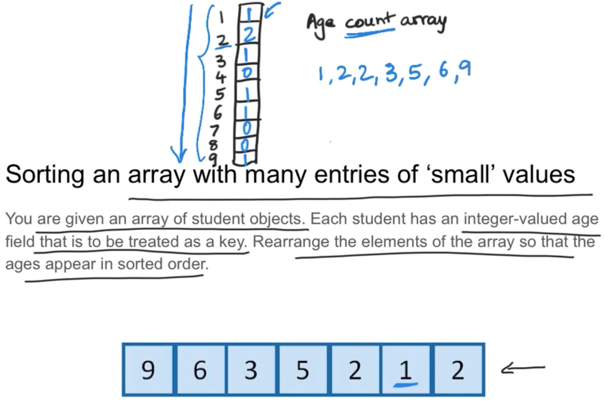

# Sorting

Note: you'll notice the worst cases for each algorithm.

Arguably, we could put at the top of each algorithm a checker to see if the elements are already sorted or not.

It would not affect as the checker would be in the worst case, a O(n) loop.

## Table of Contents

- [Sorting](#sorting)
  - [Table of Contents](#table-of-contents)
  - [1. Applications](#1-applications)
  - [2. Selection Sort](#2-selection-sort)
    - [How the iterations work:](#how-the-iterations-work)
    - [Code:](#code)
    - [Time complexity](#time-complexity)
    - [Space complexity](#space-complexity)
    - [Verdict](#verdict)
  - [3. Bubble Sort](#3-bubble-sort)
    - [How the iterations work:](#how-the-iterations-work-1)
    - [Code:](#code-1)
    - [Time complexity](#time-complexity-1)
    - [Space complexity](#space-complexity-1)
    - [Verdict](#verdict-1)
  - [4. Insertion Sort](#4-insertion-sort)
    - [How the iterations work:](#how-the-iterations-work-2)
    - [Code](#code-2)
    - [Time complexity](#time-complexity-2)
    - [Space complexity](#space-complexity-2)
    - [Verdict](#verdict-2)
  - [5. Merge Sort](#5-merge-sort)
    - [How the iterations work:](#how-the-iterations-work-3)
    - [Code](#code-3)
    - [Time complexity](#time-complexity-3)
    - [Space complexity](#space-complexity-3)
  - [6. Quicksort](#6-quicksort)
    - [How the iterations work:](#how-the-iterations-work-4)
      - [1. Naïve approach - arbitrarily select a _pivot_](#1-naïve-approach---arbitrarily-select-a-pivot)
      - [2. Lomuto's Partitioning](#2-lomutos-partitioning)
      - [3. Hoare's Partitioning](#3-hoares-partitioning)
    - [Code](#code-4)
    - [Time complexity](#time-complexity-4)
      - [Naïve approach](#naïve-approach)
      - [Lomuto's Partitioning](#lomutos-partitioning)
      - [Hoare's Partitioning](#hoares-partitioning)
    - [Space complexity](#space-complexity-4)
      - [Naïve approach](#naïve-approach-1)
      - [Lomuto's Partitioning](#lomutos-partitioning-1)
      - [Hoare's Partitioning](#hoares-partitioning-1)
  - [Merge v.s. Quick comparison](#merge-vs-quick-comparison)
    - [Empirical Time Comparison](#empirical-time-comparison)
    - [Stability Comparison](#stability-comparison)
      - [Stability in sorting algorithms so far:](#stability-in-sorting-algorithms-so-far)
      - [Stability Notes](#stability-notes)
  - [7. Heap Sort](#7-heap-sort)
    - [Transform-and-Conquer](#transform-and-conquer)
    - [About Max-Heap](#about-max-heap)
      - [Rules that it follows](#rules-that-it-follows)
    - [How the iterations work:](#how-the-iterations-work-5)
      - [In-place Heap Sort](#in-place-heap-sort)
      - [Build the Heap](#build-the-heap)
        - [Why _Build Heap_ instead of manually inserting one by one?](#why-build-heap-instead-of-manually-inserting-one-by-one)
    - [Code](#code-5)
    - [Time complexity](#time-complexity-5)
    - [Space complexity](#space-complexity-5)
    - [Stability](#stability)
  - [8. Counting Sort](#8-counting-sort)
    - [How the iterations work:](#how-the-iterations-work-6)
    - [Code](#code-6)
    - [Time complexity](#time-complexity-6)
    - [Space complexity](#space-complexity-6)
  - [9. Radix Sort](#9-radix-sort)
    - [How the iterations work:](#how-the-iterations-work-7)
      - [Why did it work?](#why-did-it-work)
    - [Code](#code-7)
    - [Time complexity](#time-complexity-7)
    - [Space complexity](#space-complexity-7)
    - [Radix vs other Sorts](#radix-vs-other-sorts)
- [Resources for this module](#resources-for-this-module)
  - [Challenges](#challenges)

Here are a series of sorting algorithms covered. Each with their own applications or general info so you know when and when NOT to use them.

1. Bubble Sort
2. Counting Sort
3. Heap Sort
4. Insertion Sort
5. Merge Sort
6. Radix Sort
7. Selection Sort
8. Quicksort

## 1. Applications

1. Finding a value faster,
2. Find duplicates,
3. Marching items in 2 or more files,
4. Find _median_ and _top k_ values quickly,
5. Truncated top of an immense sorted list is the common _User Interface_:
   - Email interface,
   - Any _feed_,
   - Google search results.
6. Help with other problems:
   - _Decrease and conquer_,
   - _Divide and conquer_.
7. Old example:
   - Punch cards - used _radix sort_ to keep them organized.

## 2. Selection Sort

Considered a brute _force algorithm_.

- It compares all possibilities without any optimized techniques.
- Searches for the _minimum_ iteratively.
- Selects and moves the next smallest to the beginning.
  - Swaps the smallest found with the _ith_ position.
- Doesn't stop comparing even if items are already sorted.
- Only one-sided swaps.
- O(n²).

### How the iterations work:

### Code:

[Code for Selection Sort here.](./selection_sort.go)

### Time complexity

- O(n²)
- Doesn't matter what we do, we'll always end up with O(n²).

### Space complexity

- O(1)
  - In place

### Verdict

**Don't use!**

- It's the worst between Selection, Bubble, and Insertion sorts.
- For learning purposes ONLY!

## 3. Bubble Sort

Scan from right to left.
As we go from right to left:

- Swap the pair if the left is greater than the right element.
- Go pair by pair until we reach the _ith_ position.

### How the iterations work:

<!--  -->

<video width="664" height="240" controls>
  <source src="./resources/bubble_example.mp4" type="video/mp4">
</video>

### Code:

[Code for Bubble Sort here.](./bubble_sort.go)

### Time complexity

- Best case: Ω(n)
- Average case: Θ(n²)
- Worst case: O(n²)

### Space complexity

- O(1)
  - In place

### Verdict

**Don't use!**

- For learning purposes ONLY!

## 4. Insertion Sort

Via **"Decrease and Conquer"**.

Background: _Insertion Sort_ is one of the examples where we can use _Decrease and Conquer_, together with _Binary Search_ or the _Euclidean Algorithm_ for example.

<u>Don't confuse</u> Decrease and Conquer **≠** Divide and Conquer.

- Decrease the given problem of size _<u>n</u>_ to size _<u>n - 1</u>_.
- "Someone else will solve the slightly smaller problem of _<u>n - 1</u>_".
- Solve the rest.
- Make the problem _slightly lower_.

Steps (Top-Down):

1. Nibble away one element to make the problem slightly smaller: _<u>n</u>_ → _<u>n - 1</u>_.
2. Handle the problem of _<u>n - 1</u>_ to "someone else" to solve.

Alternative (Bottom-Up):

1. No upfront work.
2. Someone has already solved the problem for _<u>n - 1</u>_.
3. I just need to solve for _<u>n</u>_.

We'll use **Bottom-Up** for _Insertion Sort_.

### How the iterations work:

### Code

[Code for Insertion Sort here.](./insertion_sort.go)

### Time complexity

- Best case: Ω(n)
- Average case: Θ(n·k) - O(n²)
- Worst case: O(n²)

### Space complexity

- O(1)
  - In place

### Verdict

Better than _Selection_ and _Bubble_ sorts.

Use for: **small data sets.**

## 5. Merge Sort

Via **"Divide and Conquer"**.

- Divide the problem into _multiple smaller instances_.
  - Usually dividing them by 2 at a time.
  - And of the same size.
- Recursion is often used.
- At the end we combine the solutions (_smaller instances_).

### How the iterations work:

<!--  -->

<!-- 1242 × 1038 mcd=40 -->
<video width="496" height="412" controls>
  <source src="./resources/merge_sort.mp4" type="video/mp4">
</video>

### Code

[Code for Merge Sort here.](./merge_sort.go)

### Time complexity

- Θ(n log(n))
  - Small and large datasets.

### Space complexity

- O(n)
  - Because of the helper array we use.
  - NOT an _in-place_ algorithm.

## 6. Quicksort

Also uses the strategy of **"Divide and Conquer"**, but with a twist.

_What Merge Sort does is_:

1. Divide,
2. Solve,
3. Combine.

**What Merge Sort does is**:

1. Divide.
   1. Doing the required work upfront.
2. ~~Solve~~.
3. Combine.
   - Both _Solve_ and _Combine_ become trivial.

### How the iterations work:

In the divide step:

We send the smaller numbers to the left in the divide and conquer strategy and then we send the bigger to the right.
- We need to find the median.

BUT WAIT A MINUTE...

We would need to sort the array to know the median value.
BUT WE ARE LOOKING FOR THE MEDIAN SO WE CAN SORT THE ARRAY!

#### 1. Naïve approach - arbitrarily select a _pivot_

Pick the element at the middle of the array or the one at the end or at the beginning.
- Since the selection is arbitrary, there's really no difference.
- One of the biggest cons becomes obvious:
  - We could be selecting as out pivot either a really small or super BIG value.

NOTE:

We are going to implement a **3-way partitioning**.

- It will help for duplicated elements.
  - Avoid redundant comparisons,
  - Improve efficiency,
  - Reduced recursion depth.
    - Avoid unnecessary recursive calls,
    - Fewer recursive calls.
- If all are the same, the time complexity will be O(n).

<!--  -->

<!-- 2598(2600) x 1760 mcd=40 -->
<video width="518" height="352" controls>
  <source src="./resources/quick_sort.mp4" type="video/mp4">
</video>

#### 2. Lomuto's Partitioning

You'll notice the naïve and Lomuto's approach are really similar.

**Difference**: we don't want to use an auxiliary array.

- The pivot is still there.
- We use pointers.
  - Pointers start at the beginning.

Key points:

1. Randomize your pivot.
   - Prevent poor performances.
   - Keep the average as O(n log(n)).
2. Add a condition to avoid unnecessary self swaps.

<!-- 2598 × 1760 mcd=40 -->
<video width="518" height="352" controls>
  <source src="./resources/quick_sort_lomuto.mp4" type="video/mp4">
</video>

#### 3. Hoare's Partitioning

We also use pointers for this algorithm.

- But instead of having both at the beginning.
  - Pointers are at the extremes of the (sub)array.
  - We move the pointers closer to each other, checking if we can make the problem smaller.
  - We swap elements to have < pivot on the left.

<!-- 2322 × 1348 -->
<video width="464.5" height="269.6" controls>
  <source src="./resources/quick_sort_hoare.mp4" type="video/mp4">
</video>

### Code

[Code for Quicksort here.](./quick_sort.go)

### Time complexity

#### Naïve approach

- Best case: Ω(n log(n))
  - In case the split is even.
  - _Lucky guess_.
- Worst case: O(n²)
  - Split is extremely skewed.
  - Or, if the array is already sorted, it will take O(n²).
    - Be it the elements are different or all are the same, sorted is sorted.
      - NOTE: remember why we do the _3-way partitioning_.
    - The same will happen for a completely reversed sorted array.

#### Lomuto's Partitioning

- Best case: Ω(n log(n))
- Average case: O(n log(n))
- Worst case: O(n²)

#### Hoare's Partitioning

- Best case: Ω(n log(n))
- Worst case: O(n²)
  - Even though Hoare's Partitioning is structure to avoid this case as much as possible,
  - it is still a possibility.

### Space complexity

#### Naïve approach

- O(n)

#### Lomuto's Partitioning

- O(log(n))
  - We could arguably say O(1),
  - Thus, an in place algorithm,
  - But recursion takes space.

#### Hoare's Partitioning

- O(log(n))
  - Same, We could arguably say it's an in place algorithm,
  - But we also use recursion here.

## Merge v.s. Quick comparison

Let's make a parenthesis here.

I want to share a comparison made between 3 sort algorithms:

1. Insertion Sort
2. Merge Sort
3. Quicksort

But what I want to focus on is the Merge v.s. Quick comparison.

### Empirical Time Comparison

You prob think Merge sort won.

- For starters, it's worst case scenario is _O(n log(n))_.
- While Quicksort has a worst case of _O(n²)_.

BUT take a look at this:

Crazy, right?

- Plus, Quicksort is an _<u>In Place</u>_ algorithm.

### Stability Comparison

Imagine we have any sort of schedule / time entries that we want to sort not just by time, but also by location name.

Which one do you think was _Quicksort_?

#### Stability in sorting algorithms so far:

1. Selection
   - **No**
   - 
2. Bubble
   - **Yes**
   - 
3. Insertion
   - **Yes**
   - 
4. Merge
   - **Yes**
   - 
5. Quick
   - **No**
   - 

Back to Merge v.s. Quick.

- Merge sort **IS** _stable_.
- While Quicksort **is NOT** _stable_.

Use <u>Quicksort</u> for:

1. Primitive values,
2. Sorts where the previous order doesn't matter.

Use <u>Merge Sort</u> for _objects_.

#### Stability Notes

C++ has 2 sorting functions:

1. `sort()` - Introsort, which uses a combination of Quicksort.
2. `stable_sort()` - which uses Merge Sort.

Python uses Timsort as its sorting algorithm.

Timsort:

- A combination of Merge and Insertion Sorts.
- Both are stable.
- So the result is always stable.

## 7. Heap Sort

We are going to use a new method called **Transform-and-Conquer**.

### Transform-and-Conquer

1. Transform the problem to a different representation.
   1. Representation change.
   2. An Abstract Data Type (_ADT_).
   3. An _ADT_ needs to support:
      1. Insert
      2. Delete/extract.
2. Solve the problem.

### About Max-Heap

We can represent a Max-Heap with an array.

The parent of a node will be:

- `int(i/2)`
  - Where `i` is the position of the **ith element**.
  - E.g. Node at `index 5` will have its parent at `index 2`.
  - 

#### Rules that it follows

1. _Children nodes_ are `<=` than their _parent_.
2. We always _insert_ starting from the left.
   1. Fill the left empty spaces first.
3. If the _new node inserted_ ends up being bigger than it's _parent_,
   1. Insert, then compare and swap _parent_ and _child_.
   2. Compare with the _new parent_.
   3. Stop swapping until the _new node_ is not bigger than its _parent_.
   4. Or we reached the _root_.
4. For deletion
   1. We move the last inserted element down the line to that _empty position_
   2. Then we compare to both sides,
   3. Pick the largest of the _2 children_ and swap,
   4. Continue the process until the rules are preserved.

<!-- 2378 × 1376 -->
<video width="475" height="275" controls>
  <source src="./resources/max_heap.mp4" type="video/mp4">
</video>

### How the iterations work:

Back to **Heap Sort**.

- We can talk about a _Min-Heap_ or a _Max-Heap_.

Steps:

1. Insert the n elements into a _heap_.
2. Do **extract-max/min** _n times_.
   1. Figured the time complexity?

#### In-place Heap Sort

1. Swap _root_ with _last element_.
   1. Because the root is always the largest value.
   2. We replace and **heapify**.
   3. We DON'T delete/remove the last element = ex-root, just ignore it.
2. As we swap, the highest elements will go to the right of the _array_.
3. Thus it becomes sorted.

<!-- 2228 × 1010 -->
<video width="445" height="202" controls>
  <source src="./resources/heap_sort.mp4" type="video/mp4">
</video>

#### Build the Heap

But wait a minute! We need to build the _heap_ first!

Build heap in O(n) time:

1. Remember to ignore `index 0`.
   1. We start from `index 1`.
2. We go from rightmost to left.
   1. Find the first from the right that has a child.
   2. Fix that section.
   3. Go to the next _parent_ and fix/_heapify_.
3. Remember _parent indexes_ are at `index/2`.

<!-- 2228 × 1272 -->
<video width="445" height="254.5" controls>
  <source src="./resources/build_heap.mp4" type="video/mp4">
</video>

##### Why _Build Heap_ instead of manually inserting one by one?

- Insert one by one = Time of <u>O(n log(n))</u>.
- Build Heap = Time of <u>O(n)</u>.

### Code

[Code for Heap Sort here.](./heap_sort.go)

### Time complexity

This is already covered in the [trees section](../8.trees/README.md) of this repo.

A quick recap about _Max/Min-Heaps_:

- Insertion: `O(log(n))`.
- Deletion: `O(log(n))`.
- Increase Key: `O(log(n))`.
- Decrease Key: `O(log(n))`.

Back to sorting:

- Θ(n log(n))
  - Extract _n times_.
  - Each time is _log(n)_.

### Space complexity

- O(1)
  - Yes, it can be done in-place as we saw.

### Stability

- No, it is not stable.
  - Either building or sorting will mess with the previous order.

## 8. Counting Sort

Instead of going with a _comparison based algorithm_, we'll do a different operation here to sort.

**Counting Sort** is one of the special algorithms that deal with numbers only.

- _Counting Sort_ because it counts the number's frequency.
- But precisely because it only deals with numbers,
- we can do something different than comparing as usual.

Where it shines:

- Narrow ranges
  - If the array is short but it looks like `[1000000,34,931]`.
  - We could consider it at least _n²_.

### How the iterations work:

Array in the range of:

- Min to Max

### Code

[Code for Counting Sort here.](./counting_sort.go)

### Time complexity

- O(n+k)
  - _k_ is the range in which the values can be found.

### Space complexity

- O(k)
  - _k_ is the range in which the values can be found.

## 9. Radix Sort

For _n integers_, _d digits_, in some base.

**Radix** means _base_.
- Meaning numbers can be represented in any base.

- E.g. Base 10

We could prob sort words, going char by char.

### How the iterations work:

From right to left:

1. Do a _Counting Sort_ based on the least significant digit:
   1. E.g. 
2. Do a 2nd _Counting Sort_ on the 2nd least digit:
   1. E.g. 
3. And so on:
   1. E.g. 

#### Why did it work?

- Because we look for the _ith time_ the numbers start to differ.
- The significant places where the numbers defer are all there is to it.

### Code

[Code for Radix Sort here.](./radix_sort.go)

### Time complexity

- O(nk)

### Space complexity

- O(n+k)

### Radix vs other Sorts

# Resources for this module

1. [Sorting Foundation](https://drive.google.com/file/d/1wu0zK5YrQlgGSAi9lnCrMDiDvLsHB3DZ/view)
2. [Sorting Foundation Annotations](https://docs.google.com/presentation/d/11dO8a3FXvkxsPO9IigDGf-7GC_rylmHcPPI-7abjDEA/)
3. [Big-O Cheat Sheet](https://www.bigocheatsheet.com/)
4. [Sorting Algorithms Animations](https://www.toptal.com/developers/sorting-algorithms)
5. [Counting Sort Animation](https://www.cs.usfca.edu/~galles/visualization/CountingSort.html)
6. [Radix Sort Animation](https://www.cs.usfca.edu/~galles/visualization/RadixSort.html)
7. [Dancing to the Sorts](https://youtube.com/playlist?list=PLcX11VWS1PdA4dSPip8-1JfKxFa32X53y)
8. [Sort a million integers](https://www.quora.com/What-is-the-most-efficient-way-to-sort-a-million-32-bit-integers)

## Challenges

1. [18. 4Sum](https://leetcode.com/problems/4sum/)
2. [88. Merge Sorted Array](https://leetcode.com/problems/merge-sorted-array/)
3. [215. Kth Largest Element in an Array](https://leetcode.com/problems/kth-largest-element-in-an-array/)
4. [295. Find Median from Data Stream](https://leetcode.com/problems/find-median-from-data-stream/)
5. [692. Top K Frequent Words](https://leetcode.com/problems/top-k-frequent-words/)
6. [703. Kth Largest Element in a Stream](https://leetcode.com/problems/kth-largest-element-in-a-stream/)
7. [1213. Intersection of 3 Sorted Arrays](https://leetcode.com/problems/intersection-of-three-sorted-arrays/)
